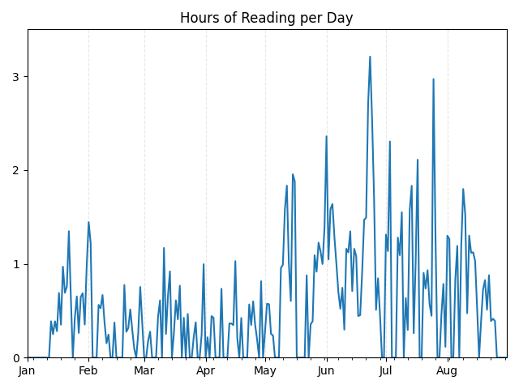

# Reading Analysis

For now mostly just gathering data.

## Notes

- Page Count on Books sheet is not really needed for full data books. In that
case, using the session data to determine a page count is better than the lazy
estimate of flipping to the end of the book. For untimed or no curve books
though, page_count should be recorded seriously, actually the correct end-start.
Probably should also for any books, but full data books can be overwritten by
session calculated page count anyway.

### Data Types

I aim to collect **full** data on most books. This means all book metadata for
summary statistics and individual session pages/times. Event data is optional
but preferred because why not? This is only possible when a book has a mostly
homogenous text density between pages. For example, a standard novel with
blocks of text cover to cover. *Not* a collection of prose and poetry, where
one page is full of text and the other is a sparse poem.

In such nonhomogenous cases, I will collect **no-curve** data, which indicates
that the book will not give a useful speed curve. Sessions for this data type
only need active time, but adding pages is fine if I want to see the curve
anyway just for fun. Events are still but moreso optional, since there isn't a
curve to label.

If timed sessions cannot be recorded or I don't feel like it (because reading
with a timer isn't always fun), I'll put them down as **untimed**, so that they
at least count towards summary statistics. Sessions and events should not be
recorded at all for untimed books.

- *This also means I can add books before the start of this project should I
wish. How cool would it be to count the words of my entire Goodreads library?
Sadly a very manual process.*

### Books

#### The Tolkien Reader (7)

- Word Count and Page count are NA because I couldn't get an epub. PDF file
was impossible to get an accurate word count from, and estimating based off
a few pages is not realistic because this book does not have a consistent
density (poetry, prose, drama all mixed in).
- Thus same reason for being no-curve

#### Edward Johnston (9)

- Photos throughout
- Word count estimated based on first 3 pages

#### Foundation and Earth, Prelude to ”, Forward the ” (5, 11, 12)

- Empty pages between chapter/parts, probably can be ignored

#### Keats : A Brief Life ... (13)

- Not sure what to do with page count, being an epub.
  - Might find a print edition as an estimate
- Exact word count still works fine
- Didn't record the first session, so leaving this one untimed. Makes things
more simple for me, and ebooks might be complicated.

#### Different Seasons (15)

- ebook so no-curve just time and pages/chars
- Page count based on first ed. Viking.

#### Beowulf: A New Verse Translation (16)

- I had the bilingual ed. Only read the English side. Page and word count based
on only the English pages.
- Session pages are the physical page #

#### The Death of Ivan Ilyich ... (17)

- Using the publication date of the titular story
  - Too many choices otherwise. Translations all have dates, each story has
  original dates, penguin has a date ...
  - Sits pretty much in the middle of the other stories, so probably the best
  average date for any analysis purposes? Or maybe not. Do the translations
  affect the reading more?
- Good example of a time where I can still do a curve even though there's separate stories: all the same kind of text and density.

#### Friday (21)

- No format available for an exact word count. Used a converted PDF---not perfect.

#### Crazy Genie (28)

- Word count based on first page because I'm lazy.

#### The Eyes of the Dragon (29)

- Page count based on first Viking ed? Maybe?

#### Gulliver's Travels (33)

- Note that I didn't read through the contents, but the pages are
recorded anyway because before them are the letters/publisher's
notes. The words are not counted, however.
